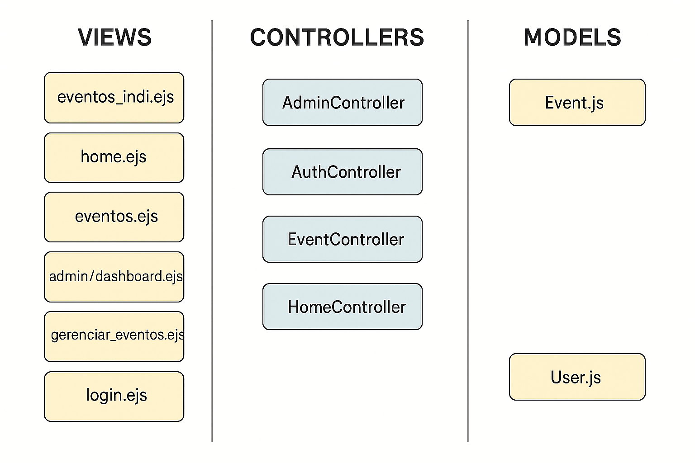

# WAD.md - Documentação Técnica

## Nome do Projeto

SambaPass - Plataforma de Ingressos via WhatsApp

---

## Descrição Técnica

Este projeto consiste em um site completo com backend em Node.js, Express.js e EJS como engine de visualização. Utiliza Supabase para banco de dados (PostgreSQL) e autenticação. Permite:

* Listar eventos por cidade
* Exibir uma página com detalhes individuais de cada evento
* Painel administrativo com login protegido e gestão completa de eventos

---

## Estrutura do Projeto

```
Projeto_Individual/
├── assets/               # Imagens e arquivos estáticos
├── config/               # Conexão com Supabase
│   └── database.js
├── controllers/
│   ├── HomeController.js
│   ├── EventController.js
│   └── AdminController.js
├── middlewares/
│   └── authMiddleware.js
├── routes/
│   └── adminRoutes.js
├── views/
│   ├── home.ejs
│   ├── eventos.ejs
│   ├── eventos_indi.ejs
│   └── admin/            # Views do painel admin
├── .gitignore
├── package.json
├── server.js
├── README.md
└── WAD.md
```

---

## Banco de Dados

O banco de dados é hospedado no Supabase e contém duas tabelas principais:

* `admins`: email, name, password (hash)
* `events`: id, nome, descricao, data, local, cidade, imagem\_url, whatsapp\_link

---

## Arquitetura MVC

* **Model**: abstração via Supabase
* **Controllers**: lógica das requisições
* **Views**: templates EJS renderizados pelo servidor
## Diagrama de Arquitetura MVC

O projeto segue a arquitetura MVC (Model-View-Controller), conforme ilustrado abaixo:





### Fluxo MVC:

1. Rota é acessada
2. Controller executa lógica com Supabase
3. View EJS é renderizada com os dados recebidos


---

## Endpoints Disponíveis

| Método | Rota                        | Ação                       |
| ------ | --------------------------- | -------------------------- |
| GET    | /                           | Tela inicial               |
| GET    | /eventos                    | Listar todos os eventos    |
| GET    | /eventos/\:cidade           | Listar eventos por cidade  |
| GET    | /evento/\:id                | Ver detalhes de um evento  |
| GET    | /admin/login                | Tela de login admin        |
| POST   | /admin/login                | Efetuar login admin        |
| GET    | /admin/dashboard            | Painel com resumo          |
| GET    | /admin/eventos              | Lista de eventos (admin)   |
| POST   | /admin/eventos              | Criar novo evento          |
| POST   | /admin/eventos/\:id         | Atualizar evento existente |
| POST   | /admin/eventos/\:id/deletar | Excluir evento             |

---

## Acesso ao Painel de Administradores

Para acessar o painel de administrador, utilize o seguinte login padrão:

* **Email:** [teste@gmail.com](mailto:teste@gmail.com)
* **Senha:** admin123

---

## Gerar Senha Hash para Admin

```js
const bcrypt = require('bcryptjs');
const senha = 'admin123';
bcrypt.hash(senha, 10).then(hash => console.log(hash));
```

Insira o hash gerado manualmente na tabela `admins` do Supabase.

---

## Execução Local

```bash
# Clonar o repositório
$ git clone https://github.com/seuusuario/Projeto_Individual.git
$ cd Projeto_Individual

# Instalar dependências
$ npm install

# Rodar servidor
$ node server.js

# Acessar via navegador
http://localhost:3000
```

---

## Considerações Finais

* O projeto é modular e pode ser expandido com novos recursos
* Pode ser adaptado para uso comercial ou institucional
* Possui design moderno e responsivo inspirado em sites como Apple e Google
