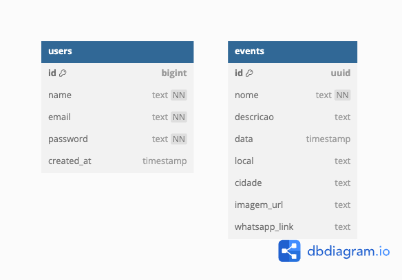

# WAD.md - Documentação Técnica

## Nome do Projeto

SambaPass – Plataforma web para exibição de eventos e venda de ingressos via WhatsApp

---

 ## Estrutura Técnica

##### Backend: 
* Node.js com Express.js

##### Frontend: 
*EJS (Embedded JavaScript Templates)

##### Banco de Dados: 
* Supabase (PostgreSQL + Storage)

##### Arquitetura: 
* MVC (Model-View-Controller)
---
## Funcionalidades Implementadas

* Listagem de cidades com eventos disponíveis

* Visualização de eventos por cidade

* Página individual do evento com imagem, descrição, data, local e botão de compra via WhatsApp

##### Painel administrativo com:

* Login de administrador com proteção de rotas

* Dashboard com resumo de cidades e eventos

* CRUD completo de eventos (criação, edição e exclusão)

* Upload de imagem via URL manual (sem Cropper.js)

* Estilização responsiva  com base em paleta verde escuro da marca
---
## Decisões Técnicas

* Supabase escolhido pela facilidade de integração com Node.js e suporte a storage

* Express + EJS por simplicidade na renderização do frontend server-side

* Organização em MVC para separar responsabilidades e facilitar manutenção


---


## Banco de Dados

O banco de dados é hospedado no Supabase e contém duas tabelas principais:



* `admins`: email, name, password (hash)
* `events`: id, nome, descricao, data, local, cidade, imagem\_url, whatsapp\_link

---

## Arquitetura MVC

* O projeto segue a arquitetura MVC (Model-View-Controller), separando de forma clara a lógica de negócio, apresentação e acesso a dados:

*  Model: abstração do acesso aos dados, feita por meio do Supabase.

* Controllers: camada responsável por lidar com as requisições HTTP, manipular os dados (via Supabase) e decidir qual view renderizar.

* Views: páginas construídas com templates EJS, renderizadas no servidor com os dados dinâmicos.
---
## Diagrama de Arquitetura MVC

O projeto segue a arquitetura MVC (Model-View-Controller), conforme ilustrado abaixo:


### Fluxo MVC:

1. O usuário acessa uma rota.

2. A controller associada executa a lógica da aplicação.

3. Os dados são buscados e manipulados via Supabase (model).

4. A view EJS é renderizada com os dados e enviada como resposta.


---

## Endpoints Disponíveis

###  Rotas da Aplicação

| Método | Rota                           | Ação                          |
|--------|--------------------------------|-------------------------------|
| GET    | `/`                            | Tela inicial (listar cidades) |
| GET    | `/eventos`                     | Listar todos os eventos       |
| GET    | `/eventos/:cidade`             | Listar eventos por cidade     |
| GET    | `/evento/:id`                  | Ver detalhes de um evento     |
| GET    | `/admin/login`                 | Tela de login do admin        |
| POST   | `/admin/login`                 | Efetuar login do admin        |
| GET    | `/admin/dashboard`             | Painel com resumo             |
| GET    | `/admin/eventos`               | Lista de eventos (admin)      |
| GET    | `/admin/eventos/novo`          | Formulário de novo evento     |
| POST   | `/admin/eventos`               | Criar novo evento             |
| GET    | `/admin/eventos/:id/editar`    | Formulário de edição de evento|
| POST   | `/admin/eventos/:id`           | Atualizar evento existente    |
| POST   | `/admin/eventos/:id/deletar`   | Excluir evento                |


---

## Acesso ao Painel de Administradores

Para acessar o painel de administrador, utilize o seguinte login padrão:

* **Email:** [teste@gmail.com](mailto:teste@gmail.com)
* **Senha:** admin123

---

## Gerar Senha Hash para Admin

```js
const bcrypt = require('bcryptjs');
const senha = 'admin123';
bcrypt.hash(senha, 10).then(hash => console.log(hash));
```

Insira o hash gerado manualmente na tabela `admins` do Supabase.

---

## Execução Local

```bash
# Clonar o repositório
$ git clone https://github.com/seuusuario/Projeto_Individual.git
$ cd Projeto_Individual

# Instalar dependências
$ npm install

# Rodar servidor
$ node server.js

# Acessar via navegador
http://localhost:3000
```
---
## Principais Aprendizados e Desafios

* Integração com Supabase e manipulação de imagens no backend

* Implementação de autenticação protegida com express-session

* Tratamento de erros e feedback visual para ações administrativas

* Melhoria do design para responsividade e usabilidade com HTML e CSS puro
---
##  O que Funcionou Bem

* Listagem e filtragem de eventos por cidade

* Estrutura clara de rotas protegidas e públicas

* CRUD de eventos funcional e intuitivo
---
## O que Pode Melhorar Futuramente

* Substituir input manual de imagem por upload via arquivo

* Melhorar feedback visual com loading states e mensagens de confirmação

* Adicionar suporte a múltiplos administradores e níveis de permissão


---

## Considerações Finais

* O projeto é modular e pode ser expandido com novos recursos
* Pode ser adaptado para uso comercial ou institucional
* Possui design moderno e responsivo inspirado em sites como Apple e Google
