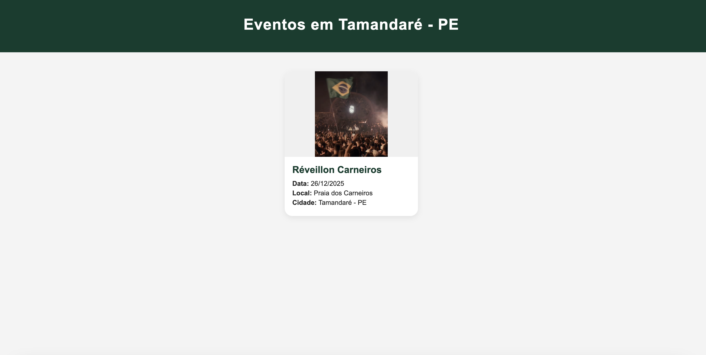
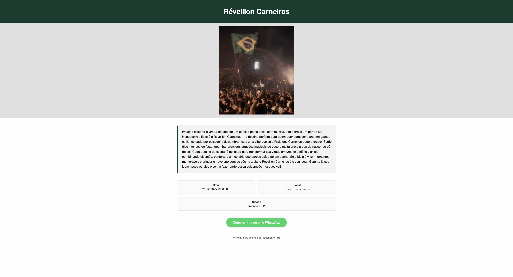
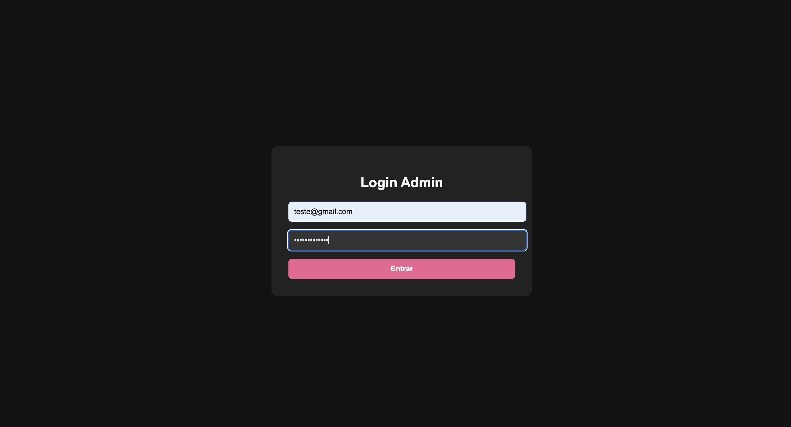
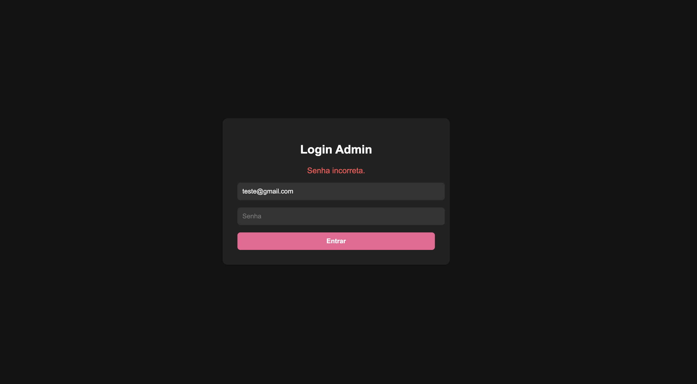
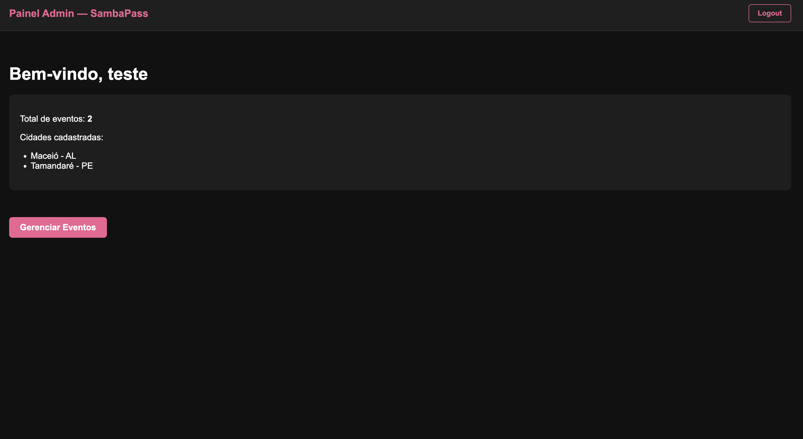
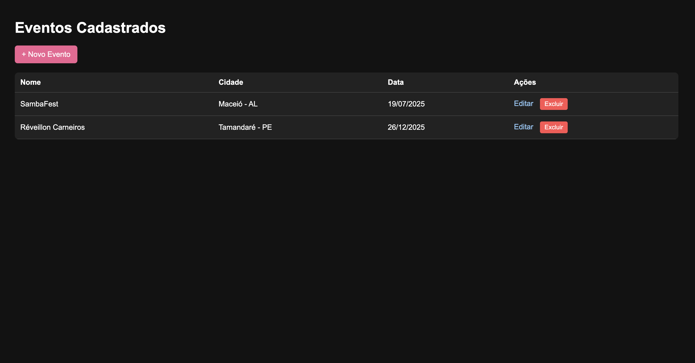
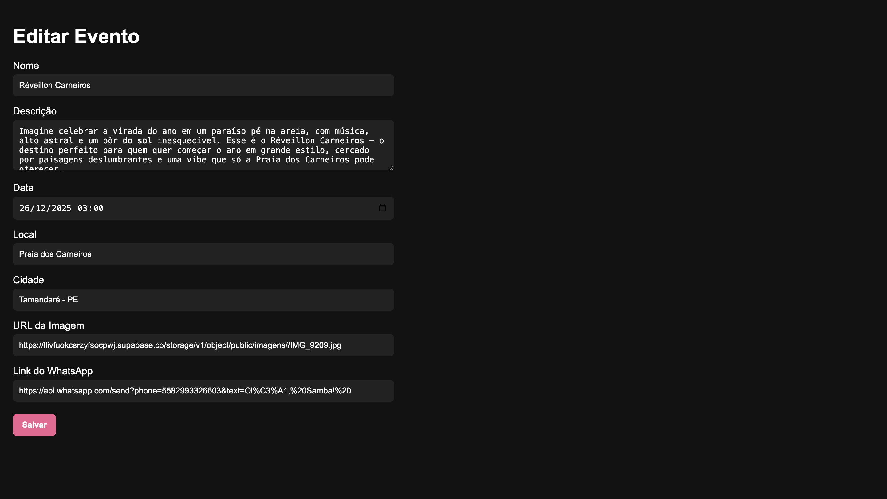

# SambaPass

Sambapass é uma fintech fundada em 2024, focada na divulgação de eventos e na venda de ingressos por meio de um chatbot no WhatsApp. A plataforma é composta por duas partes: uma experiência intuitiva para o público geral e um painel administrativo completo para a gestão eficiente de eventos.

---
## Visão Geral

O site principal é focado em um layout elegante e responsivo, com destaque para as cidades onde os eventos acontecem e para os principais Réveillons. As compras são direcionadas para o WhatsApp da empresa.

O painel de administrador oferece funcionalidades completas de CRUD para eventos, login protegido e um dashboard com resumos importantes.

---

## Funcionalidades

### Público Geral

* Tela inicial com lista de cidades e categoria especial para Réveillons
* Listagem de eventos filtrada por cidade
* Página individual de cada evento com imagem, data, local e botão de compra via WhatsApp

### Administrador

* Login com autenticação segura
* Dashboard com total de eventos e cidades
* CRUD completo de eventos (criar, editar, excluir)
* Upload de imagem via URL
* Botão de logout
---
## Tecnologias Utilizadas

* Node.js + Express.js
* Supabase (Banco de dados PostgreSQL + autenticação + Storage)
* EJS (templates)
* HTML e CSS puro (design responsivo)
* Express-session (autenticação)
---
## Como Executar o Projeto

```bash
# Clone o repositório
git clone https://github.com/seu_usuario/Projeto_Individual_final

# Instale as dependências
npm install

# Inicie o servidor
node server.js

# Acesse em
http://localhost:3000
```
---
## Cadastro de Administrador

A tabela `admins` deve ser preenchida manualmente no Supabase. Para gerar o hash da senha:

```js
const bcrypt = require('bcryptjs');
bcrypt.hash('suaSenhaAqui', 10).then(console.log);
```

Copie o hash gerado e insira junto com nome e email no Supabase.

---
## Prints da Interface :


##### 1. Imagem com mascote do SambaPass. Exibe botões para selecionar cidades e categorias de eventos como "Réveillons". É o ponto de entrada do site.



##### 2. Página que mostra os eventos filtrados pela cidade escolhida. Cada card mostra nome, data, local e cidade do evento.


##### 3. Mostra os detalhes completos de um evento: imagem grande, descrição, data, local, cidade e botão para compra de ingressos via WhatsApp.

##### 4. Interface de login para administradores com design escuro e moderno. Campos de email e senha.


##### 5. Mensagem de erro "Senha incorreta" exibida quando as credenciais não conferem.

##### 6. Após login, mostra resumo do sistema: total de eventos e cidades cadastradas. Link para gerenciar eventos.

##### 7. Admin visualiza todos os eventos cadastrados com opções para editar ou excluir. Botão para adicionar novo evento.

##### 8. Formulário completo para editar dados do evento, incluindo nome, descrição, data, local, cidade, link da imagem e link do WhatsApp.

--- 


## Licença

Este projeto é destinado a fins educacionais e demonstrativos. Todos os direitos reservados à equipe SambaPass.
